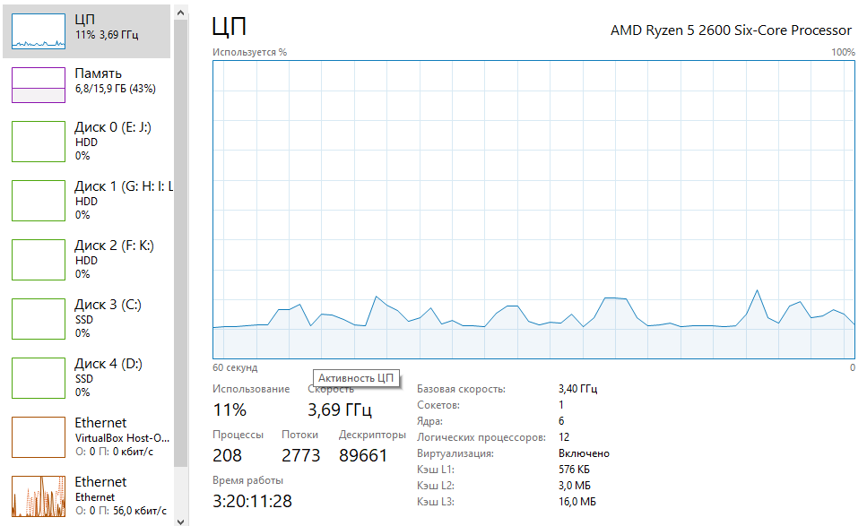
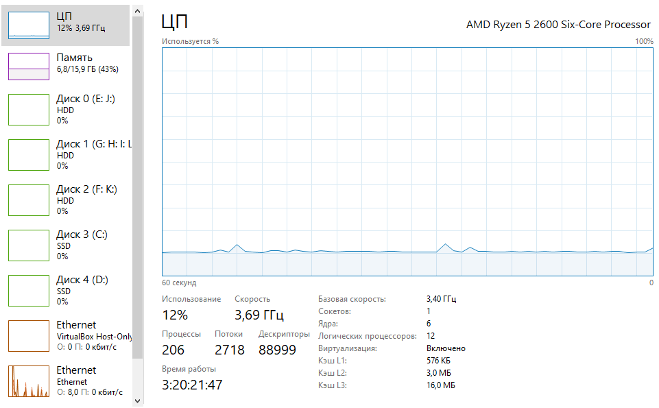
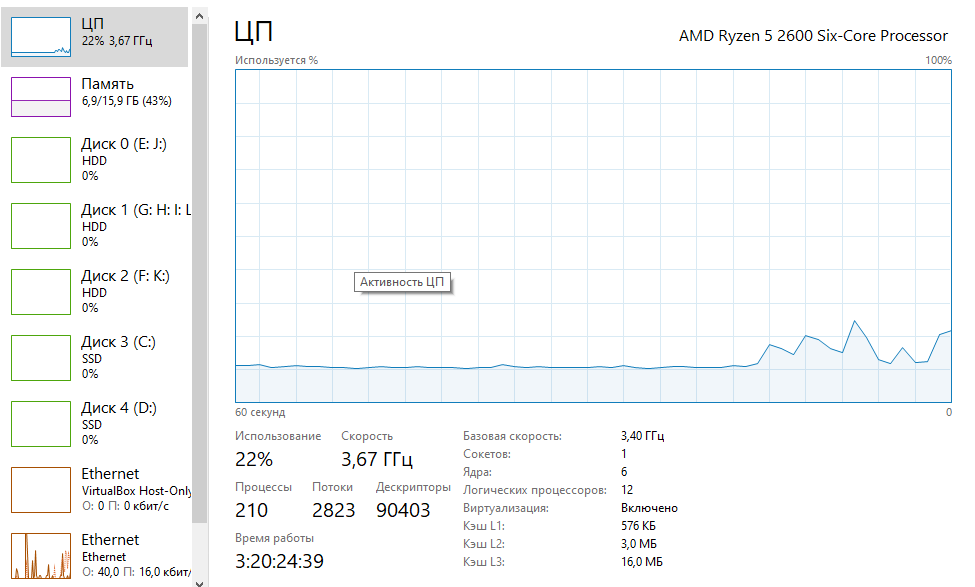
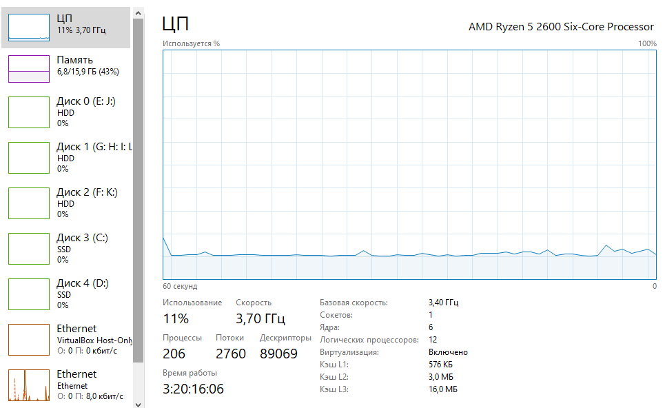
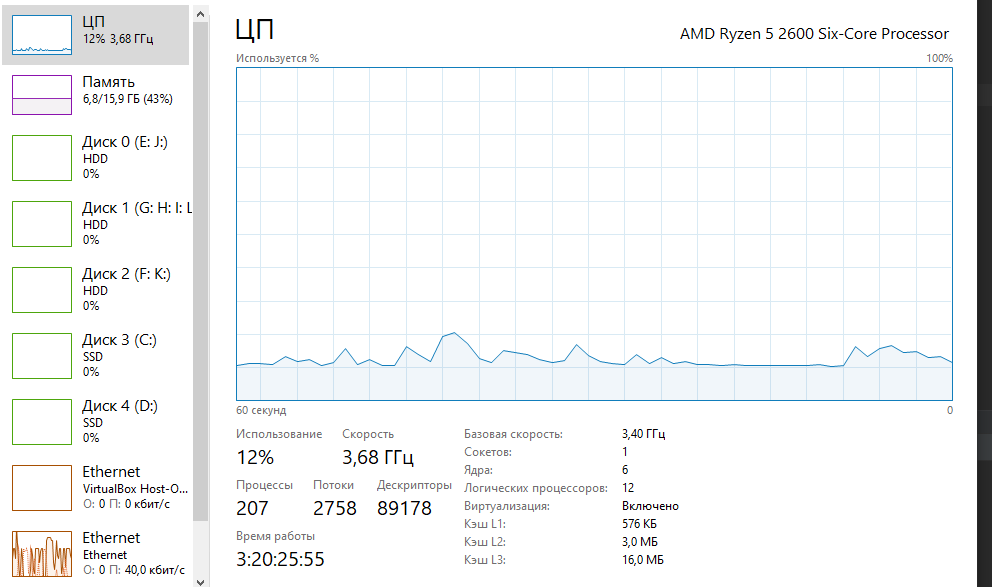
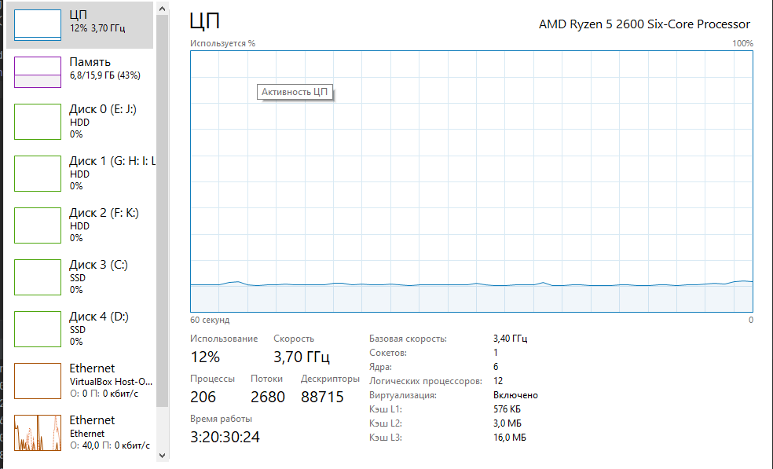

1) Синхронный поиск токена
 
2) 2 Воркера

3) 4 воркера

4) 5 воркеров

5) 10 воркеров

6) 61 воркер (максимальное количество воркеров)

Вывод: Так как задача CPU bound, наращивать количество воркеров, большее количества ядер, бесполезно.