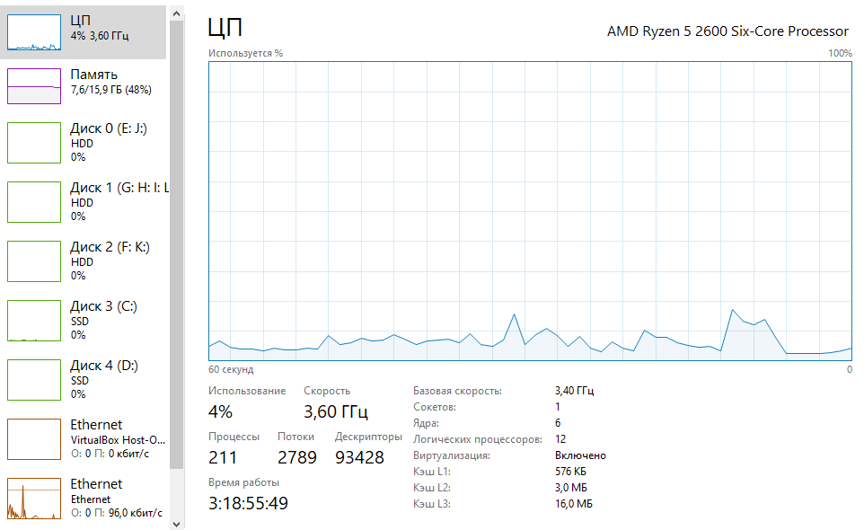

1) Синхронная проверка

2) Пять воркеров

3) Десять воркеров

4) Сто воркеров

Вывод: Время работы с увеличением количества воркеров уменьшается.
Загрузка памяти практически не изменяется, а загрузка процессора и сети немного увеличивается.